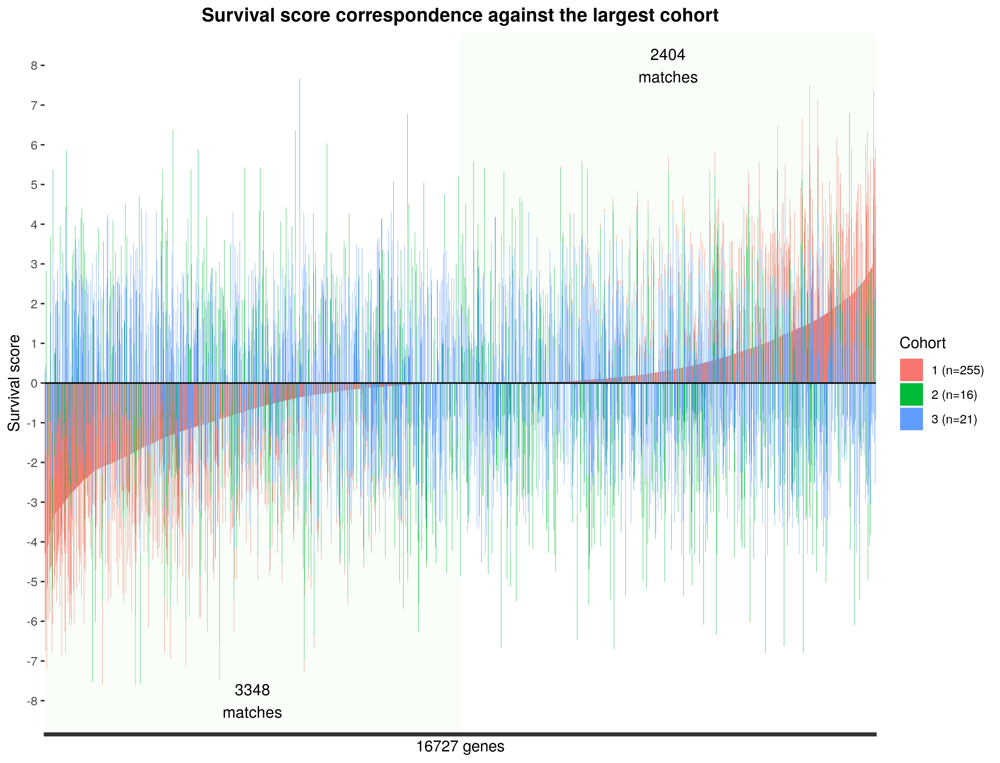

```{r setup, include=FALSE}
knitr::opts_chunk$set(echo = TRUE)
```

# Introduction notes

The curatedBreastData package contains 34 high-quality GEO gene expression microarray datasets,
all with advanced breast cancer represented as S4 ExpressionObjects with attached clinical data (phenoData) 
for easier data analyses in R.
 
You will learn to explore this type of objects in R and to extract genetic and clinical feature.

We will overlook the Cox regression model for survival analysis and explore the relevance of most of the clinical covariates toward survival time. 
 
# curatedBreastData package: Access & explore the data

These datasets all contain at least one survival and/or
treatment response variable, and minimal treamtent information (such as whether they had
chemotherapy or not.) Clinical variables were semantically normalized across all datasets to
provide a powerful database for investigating genes that are related to clinical variables such
as pathological complete response, ER and HER2 IHC pathology tests, pam50 subtyping tests
(when available), and tumor stage.
This database was original designed as a MySQL database, but has been re-represented as
S4 ExpressionObjects for easier data analyses in R.

<br/>

## Loading packages
```{r load packages}
suppressMessages(library(Biobase))
suppressMessages(library(limma))
suppressMessages(library(survival))
suppressMessages(library(survminer))
suppressMessages(library("curatedBreastData"))
suppressMessages(library(survivalROC))
suppressMessages(library(tibble))
suppressMessages(library(purrr))
suppressMessages(library(tidyr))
suppressMessages(library(dplyr))
suppressMessages(library(FactoMineR))

```

## Loading data

```{r load data, cache=T}
#load up datasets that are in S4 expressionSet format.
#clinical data from master clinicalTable already linked to each sample
#in these ExpressionSets in the phenoData slot.

data(curatedBreastDataExprSetList)
data(clinicalData)
```

## First layer: the list of ExpressionSets

```{r exploring the data}
#renaming for easier handling

list.eset=curatedBreastDataExprSetList

# How big is loaded object
length(list.eset)

# what's inside ? 
head(names(list.eset))


```

```{r exploring the list}
#What are the dimensions of each eset (samples and genes)
dims=c()
for (l in seq_along(curatedBreastDataExprSetList))
{
  dims=rbind(dims,dim(curatedBreastDataExprSetList[[l]]))
}
plot(dims[,2],dims[,1],type = 'h',
     xlab = c('samples ', paste(range(dims[,2]),collapse = '->'),sep=''),
     ylab= c('features ',paste(range(dims[,1]),collapse = '->'),sep=''), 
     col=c(1:34),
     main="Samples and features number across esets")


```


## Exploring the ExpressionSet

### -ExpressionSet Structure summary

```{r, include=F}
url="http://images3.programmersought.com/725/95/95c8a0138aab06a2dbb8858b256368f5.png"
```


<br/>

ExpressionSet is an object of type S4 that can be explored using the accessor "@" (S4 itself) and "$" (elements within S4)

<br/>

### - Use `eset@assayData$exprs` or exprs() to access gene expression data 
```{r eset exprs}

# lets look inside one object
eset=list.eset[[4]]  

class(eset)

class(eset@assayData$exprs)
# or via methods of ExpressionSet objects (Biobase)
# class(exprs(eset))
head(exprs(eset))[,c(1:5)]

```

### - Use `eset@featureData@data` or fData() to access features (gene) metadata 

```{r eset fdata}

class(fData(eset)$gene_symbol)
# or via methods of ExpressionSet objects (Biobase)
# class(fData(eset)$gene_symbol)
head(levels(fData(eset)$gene_symbol))

```

**<span style="color:red">* Use @ and $ accessors to obtain the same results</span>**

```{r}
#enter your code here 

```

### - eset dimensions
```{r eset dim}
dim(eset)
```

### - Use `eset@phenoData@data` or pData() to access samples pheno data

```{r eset pData}
head(pData(eset)[c(1:3), c(1:7)])

paste(names(pData(eset)),sapply(pData(eset), class),sep = " - ")[c(1:10,143:153)]

```


Usually, only the first 30~40 first info slots are availables upon data collection.
It's very rare to have access to clinical data, here the clinical data has been collected by the package developpers. 

### - Let's have a look at another unprocessed dataset.

```{r, echo=T, message=FALSE, cache=T}
gse=GEOquery::getGEO('GSE39591')
```


**<span style="color:red">* Use the class function on gse, gse$GSE39591_series_matrix.txt.gz </span>** 

**<span style="color:red">* Use pData and fData to overlook the phenotypic and feature data. </span>** 


```{r}
#enter your code here 

```

<br/> 

## Overview of the gene expression: \ndensity & heatmap & MDS plots

Back to breast cancer data. 
For the rest of the analysis we will focus on the 4th dataset in the eset list because 
there are some interesting clinical data associated to it. 

```{r most variable genes init, echo=F}

selected=4
proc_eset <-
  processExpressionSetList(exprSetList=list.eset[selected], numTopVarGenes=1000)[[1]]

# lets have a look at the distribution
limma::plotDensities(exprs(eset),legend=F, main='Features density across samples')


heatmap(exprs(proc_eset), main='Heatmap of the 1000 most variable genes')
df=exprs(proc_eset)
d <- dist(t(df)) # euclidean distances between the rows
fit <- cmdscale(d,eig=TRUE, k=2) # k is the number of dim

# plot solution
x <- fit$points[,1]
y <- fit$points[,2]

cols=pData(eset)$OS+1
plot(x, y, xlab="mds 1", ylab="mds 2",
  main="Metric MDS", type="n"); text(x, y, labels = colnames(df), cex=.7,col=cols)

```

> Survival of the patient is overlayed in color (black: remission, red: relapse) 

**These vizualisation gives us some insights on the quality of the expression set we are analysing.**

  * We can have a look to the distribution of the feature (genes) expressions.
  * We can overlook the expression of the top 1000 most variable genes in a heatmap to see wether or not some patterns already emerge.
  * We can see here that the 1000 most variable genes fail to explain the survival of the patients.

<br/>

# Cox Proportional Hazards Regression Analysis

### Basic concepts

* __Survival time__
    * Event-free survival time

* __Censoring__ 
end of following (e.g. end of treatment / no event / loss of consent)

* __Events__
    * Relapse 
    * Death

* __Survival probability__ 

function S(t): survival probability of an individual from t0 to t

$$S(t)=S(t−1)(1−d*n)$$

* *Where*
    * *S(t−1) = the probability of being alive at t−1*
    * *n = the number of patients alive just before t*
    * *d = the number of events at t*
    * *dt0 = 0*
    * *S(0) = 1*

<br/>
  
* __Hazard ratio probalility__

function h(t): event probability at time t

exp(coefficient) gives you the survival ratio between two groups

(i.e: exp(coefficient)=0.2 means that the risk group has 20% more chance of an occuring event)

<br/>

### Visualization

* __Kaplan-Meier plot__

Represent the estimation of the survival probability 
based on true survival times.
*(Kaplan and Meier, J Am Stat Assoc, 1958).*


S(t) is a **step** function that **changes value only at the time of each event**. 

Provides a useful summary of the data that can be used to estimate measures such as **median survival time**.


## Sorting out the clinical table
```{r clinical 0}
clinical=pData(eset)

clinical=data.frame(clinical$study_ID,
           clinical$OS,
           clinical$OS_months_or_MIN_months_of_OS,
           clinical$RFS,
           clinical$RFS_months_or_MIN_months_of_RFS,
           clinical$metastasis,
           clinical$age,
           clinical$ER_preTrt,
           clinical$ER_fmolmg_preTrt,
           clinical$tumor_size_cm_preTrt_preSurgery,
           clinical$tumor_stage_preTrt,
            clinical$preTrt_lymph_node_status,
           clinical$ERBB2_CPN_amplified,
           clinical$Erbeta_preTrt,
           clinical$PTEN_mutation,
           clinical$PTEN_pos
           )

paste(names(clinical),sapply(clinical, class),sep = " - ")
```

**<span style="color:red">* Use the head function to display the content of the variable named "clinical" </span>** 

```{r}

#Your code here

```
 
## Gene expression impact on survival

HER2-positive breast cancer (Lancet, 2016)
IF: 47.831 (2016) -> 59.102 (2019)

Anti-HER2 treatment for HER2-positive breast cancer has changed the natural biology of this disease. This Series article reviews the main achievements so far in the treatment of both metastatic and early HER2-positive breast cancer. The success of neoadjuvant therapy in HER2-positive early breast cancer is especially acknowledged, as pertuzumab has been approved on the basis of a higher proportion of patients achieving a pathological complete response with pertuzumab and trastuzumab than with trastuzumab alone in a neoadjuvant study. Event-free survival after the confirmatory adjuvant trial completed recruitment was numerically better with pertuzumab plus trastuzumab than with trastuzumab alone. With survival rates of almost 5 years in women with metastatic HER2-positive breast cancer and 75% of patients achieving a pathological complete response, new treatments in the past decade have clearly improved the prognosis of HER2-positive breast cancer. Despite these achievements, however, the persisting high toll of deaths resulting from HER2-positive breast cancer calls for continued, intensive clinical research of newer therapies and combinations.

```{r, include=F}
url="https://marlin-prod.literatumonline.com/cms/attachment/3a4eb87d-98c3-4937-b080-89e2639c0ab7/gr1.jpg"
```


<br/>

**<span style="color:darkblue">- Using the mean of gene expression of all patients as a cut-off, it is possible to discretize (0: low expression, 1: high expression) the gene expression to create two groups of patients.</span>** 

<br/>


#### - ERBB2 - receptor tyrosine kinases

```{r, echo=F}

g=which(fData(eset)$gene_symbol=="ERBB2IP")
subset=apply(exprs(eset)[g,],MARGIN = 2,FUN = max)
erbb2=ifelse(subset>mean(subset),1,0)

gene=erbb2

fit <- survfit(Surv(clinical$clinical.OS_months_or_MIN_months_of_OS,clinical$clinical.OS) ~ gene ,                 
            data = data.frame(clinical))
fit_table <- coxph(Surv(clinical$clinical.OS_months_or_MIN_months_of_OS,clinical$clinical.OS) ~ gene)
info=summary(fit_table)
pval=info$sctest[3]
coef=info$coefficients[1]
HR=info$coefficients[2]*10
print(pval)

if (pval<0.05){print(HR)}

fit0 <- survfit(Surv(clinical$clinical.OS_months_or_MIN_months_of_OS,clinical$clinical.OS) ~ 1,
              data = data.frame(clinical))
ggsurvplot(list('risk'=fit,'null.model'=fit0),data=clinical,
           pval = TRUE,palette =c("steelblue2", "coral2",'Grey'),legend.labs =
               c("low expression\ngroup","high expression\ngroup","all patients"),linetype = c(1,1,2),censor.shape="x", censor.size = 3,
           title = "\tSurvival model - ERBB2",xlab = "Time in Days",pval.method =   TRUE,
           ggtheme = theme_bw(), ncensor.plot = F, combine = T,surv.scale=c("percent"), xlim = c(0, 145))

```


#### - PTEN - tumor suppressor 

```{r echo=T, results='hide'}
g=which(fData(eset)$gene_symbol=="PTEN")
subset=apply(exprs(eset)[g,],MARGIN = 2,FUN = max)
pten=ifelse(subset>mean(subset),1,0)

gene=pten

fit <- survfit(Surv(clinical$clinical.OS_months_or_MIN_months_of_OS,clinical$clinical.OS) ~ gene ,                 
          data = data.frame(clinical))
fit_table <- coxph(Surv(clinical$clinical.OS_months_or_MIN_months_of_OS,clinical$clinical.OS) ~ gene)
info=summary(fit_table)
pval=info$sctest[3]
coef=info$coefficients[1]
HR=info$coefficients[2]*10
if (pval<0.05){print(pval);print(HR)}

fit0 <- survfit(Surv(clinical$clinical.OS_months_or_MIN_months_of_OS,clinical$clinical.OS) ~ 1,
              data = data.frame(clinical))
ggsurvplot(list('risk'=fit,'null.model'=fit0),data=clinical,
           pval = TRUE,palette =c("steelblue2", "coral2",'Grey'),legend.labs =
               c("low expression\ngroup","high expression\ngroup","all patients"),
           linetype = c(1,1,2),censor.shape="x", censor.size = 3,
           title = "\tSurvival model - PTEN",xlab = "Time in Days",pval.method =   TRUE,
           ggtheme = theme_bw(), ncensor.plot = F, combine = T,surv.scale=c("percent"), xlim = c(0, 145))
```


```{r, echo=F}


url="https://raw.githubusercontent.com/raph06/statistics/master/ranked_survival_score_correspondance.png"
url2="http://dni-institute.in/blogs/wp-content/uploads/2015/02/cox_regression_output.png"

```

<br/>

Better survival for high expression group for PTEN expression is consistent with its tumor suppressor function.

**Be very carful when anylising expression data as many other confounding factors can be responsible for the heterogeneity from one cohort to another.**


<br/>

Here is an example of cohort heterogeneity of survival scores across all genes



<br/>

**<span style="color:red">Less than 35% </span>** **((3348 + 2404)/ 16727) of genes have the same impact on survival in 3 independant cohorts. **

<br/>

**<span style="color:red">In silico hypothesis must be confronted to a biological experiment</span>**

<br/>

## Relapse impact on survival

```{r relapse}
fit0 <- survfit(Surv(clinical$clinical.OS_months_or_MIN_months_of_OS,clinical$clinical.OS) ~ 1,
              data = data.frame(clinical))
fit <- survfit(Surv(clinical$clinical.OS_months_or_MIN_months_of_OS,clinical$clinical.OS) ~ clinical$clinical.RFS,
               data = data.frame(clinical))
fit_table <- coxph(Surv(clinical$clinical.OS_months_or_MIN_months_of_OS,clinical$clinical.OS) ~ clinical$clinical.RFS)
info=summary(fit_table)
print(info)


  
```

#### Statistics:


* Likelihood ratio / Wald test / Score (logrank) test : there is no difference in survival between the two groups (H0)

**<span style="color:red">- To what correspond the fit0 variable ?</span>**

**<span style="color:red">- Display the 'fit' variable, what are the proportions of events for each group ?</span>**

**<span style="color:red">- What is the pvalue for this model ?</span>**

**<span style="color:red">- What is the hazard ratio between the two groups ? What does it mean ?</span>**

```{r relapse 2.1}

#Your code here

```


```{r relapse3}

ggsurvplot(list('risk'=fit,'null.model'=fit0),data=clinical,
           pval = TRUE,palette =c("coral2","steelblue2",'Grey'),legend.labs =
               c("Relapse\ngroup","Relapse-free\ngroup","all patients"),linetype = c(1,1,2),censor.shape="x", censor.size = 3,
           title = "\tSurvival model - Relapse free survival",xlab = "Time in Days",pval.method =   TRUE,
           ggtheme = theme_bw(), ncensor.plot = F, combine = T,surv.scale=c("percent"), conf.int = TRUE, xlim = c(0, 145))

   
   
```

### How good is your model

```{r, echo=F}
url='https://3.bp.blogspot.com/--jLXutUe5Ss/VvPIO6ZH2tI/AAAAAAAACkU/pvVL4L-a70gnFEURcfBbL_R-GnhBR6f1Q/s1600/ConfusionMatrix.png'
```


<br/>


```{r relapse2, echo=T}

#predict function
lp.pred <- predict(fit_table,
                  type="lp",
                  data=data.frame(clinical))


## Define a helper function to evaluate at various t
survivalROC_helper <- function(t) {
    survivalROC(Stime        = clinical$clinical.OS_months_or_MIN_months_of_OS,
                status       = clinical$clinical.OS,
                marker       = lp.pred,
                predict.time = t,
                method       = "NNE",
                span = 0.25 * nrow(clinical)^(-0.20))
}
## Evaluate at day 145

survivalROC_data <- tibble(t = 145) %>%
    mutate(survivalROC = map(t, survivalROC_helper),
           ## Extract scalar AUC
           auc = map_dbl(survivalROC, magrittr::extract2, "AUC"),
           ## Put cut off dependent values in a data_frame
           df_survivalROC = map(survivalROC, function(obj) {
               as_tibble(obj[c("cut.values","TP","FP")])
           })) %>%
    dplyr::select(-survivalROC) %>%
    unnest(cols = c(df_survivalROC)) %>%
    arrange(t, FP, TP)

## Plot
survivalROC_data %>%
    ggplot(mapping = aes(x = FP, y = TP)) +
    geom_point() +
    geom_line() +
    geom_label(data = survivalROC_data %>% dplyr::select(t,auc) %>% unique,
               mapping = aes(label = sprintf("%.3f", auc)), x = 0.5, y = 0.5) +
    facet_wrap( ~ t) +
    theme_bw() +
    theme(axis.text.x = element_text(angle = 90, vjust = 0.5),
          legend.key = element_blank(),
          plot.title = element_text(hjust = 0.5),
          strip.background = element_blank())


```

<br/>

A receiver operating characteristic curve, or ROC curve, is a graphical plot that illustrates the diagnostic ability of a **binary** classifier system as its discrimination threshold is varied.
It represent the FPR (false positive rate) against the TPR (true positive rate)

## Metastasis impact on survival


```{r metastasis, echo=F}

fit <- survfit(Surv(clinical$clinical.OS_months_or_MIN_months_of_OS,clinical$clinical.OS) ~ clinical$clinical.metastasis,
             data = data.frame(clinical))
fit_table <- coxph(Surv(clinical$clinical.OS_months_or_MIN_months_of_OS,clinical$clinical.OS) ~ clinical$clinical.metastasis)
info=summary(fit_table)
print(info)

pval=info$sctest[3]
coef=info$coefficients[1]

ggsurvplot(list('risk'=fit,'null.model'=fit0),data=clinical,
           pval = TRUE,palette =c("steelblue2", "coral2",'Grey'),legend.labs =
               c("No metastasis\ngroup","Metastasis\ngroup","all patients"),
          linetype = c(1,1,2),censor.shape="x", censor.size = 3,
           title = "\tSurvival model - Metastasis",xlab = "Time in Days",pval.method =   TRUE,
           ggtheme = theme_bw(), ncensor.plot = F, combine = T,surv.scale=c("percent"), xlim = c(0, 145) )


```

<br/>

## Age impact on survival

**<span style="color:red"> - Complete the code to evaluate the age impact on survival</span>**

**<span style="color:red"> - Break the cohort into two groups (< and >=50 years old)</span>**

**<span style="color:red"> - Once it's done, remove the eval=F tag in the markdown in the next plot chunk (age2) header to plot the results</span>**

**<span style="color:red"> - What can you say about the results of the regression model ? </span>**


```{r age, include=T, eval=F}

fit <- survfit(Surv(clinical$clinical.OS_months_or_MIN_months_of_OS,clinical$clinical.OS) ~ 'your code here' ,
               data = data.frame(clinical))
fit_table <- coxph(Surv(clinical$clinical.OS_months_or_MIN_months_of_OS,clinical$clinical.OS) ~ 'your code here')
info=summary(fit_table)
print(info)

pval=info$sctest[3]
coef=info$coefficients[1]
HR=info$coefficients[2]*10
  
```

```{r age2, eval=F}
if (pval<0.05){print(HR)}

print(pval)

ggsurvplot(list('risk'=fit,'null.model'=fit0),data=clinical,
         pval = TRUE,palette =c("steelblue2", "coral2",'Grey'),legend.labs =
             c("<50 yrs old\ngroup","> 50 yrs old\ngroup","all patients"),
        linetype = c(1,1,2),censor.shape="x", censor.size = 3,
         title = "\tSurvival model - Age",xlab = "Time in Days",pval.method =   TRUE,
         ggtheme = theme_bw(), ncensor.plot = F, combine = T,surv.scale=c("percent"),xlim = c(0, 145) )


```

<br/>

## Tumor size impact on survival

```{r tumor, include=F}

fit <- survfit(Surv(clinical$clinical.OS_months_or_MIN_months_of_OS,clinical$clinical.OS) ~ (clinical$clinical.tumor_size_cm_preTrt_preSurgery>mean(clinical$clinical.tumor_size_cm_preTrt_preSurgery)),
               data = data.frame(clinical))
fit_table <- coxph(Surv(clinical$clinical.OS_months_or_MIN_months_of_OS,clinical$clinical.OS) ~ (clinical$clinical.tumor_size_cm_preTrt_preSurgery>mean(clinical$clinical.tumor_size_cm_preTrt_preSurgery)))
info=summary(fit_table)
print(info)

pval=info$sctest[3]
coef=info$coefficients[1]
HR=info$coefficients[2]*10
  
```

```{r meta2, echo=F}
print(pval)
if (pval<0.05){print(pval);print(HR)}
ggsurvplot(list('risk'=fit,'null.model'=fit0),data=clinical,
           pval = TRUE,palette =c("steelblue2", "coral2",'Grey'),legend.labs =
               c("Smaller tumor\ngroup","Bigger tumor\ngroup","all patients"),
          linetype = c(1,1,2),censor.shape="x", censor.size = 3,
           title = "\tSurvival model - Tumor size (preTrt)",xlab = "Time in Days",pval.method =TRUE,
           ggtheme = theme_bw(), ncensor.plot = F, combine = T,surv.scale=c("percent"), xlim = c(0, 145) )

  
```

<br/>

## Mutations impact on survival

### - ERBB2 amplification

```{r mutations, include=F}

fit <- survfit(Surv(clinical$clinical.OS_months_or_MIN_months_of_OS,clinical$clinical.OS) ~ clinical$clinical.ERBB2_CPN_amplified ,                 data = data.frame(clinical))
fit_table <- coxph(Surv(clinical$clinical.OS_months_or_MIN_months_of_OS,clinical$clinical.OS) ~ clinical$clinical.ERBB2_CPN_amplified)
info=summary(fit_table)
print(info)

pval=info$sctest[3]
coef=info$coefficients[1]
HR=info$coefficients[2]*10
```


```{r, echo=F}
print(pval)
if (pval<0.05){print(pval);print(HR)}
ggsurvplot(list('risk'=fit,'null.model'=fit0),data=clinical,
           pval = TRUE,palette =c("steelblue2", "coral2",'Grey'),legend.labs =
               c("down group","up group","all patients"),linetype = c(1,1,2),censor.shape="x", censor.size = 3,
           title = "\tSurvival model - ERBB2 amplification",xlab = "Time in Days",pval.method =   TRUE,
           ggtheme = theme_bw(), ncensor.plot = F, combine = T,surv.scale=c("percent"), xlim = c(0, 145) )

```

 <br/>
 

## Survival across studies

```{r studies, echo=F}
studies=c("6577","16446","22226")
clinical=clinicalData$clinicalTable[which(clinicalData$clinicalTable$study_ID%in%studies),]

fit <- survfit(Surv(clinical$OS_months_or_MIN_months_of_OS,clinical$OS) ~ clinical$study_ID,                 
           data = data.frame(clinical))
fit_table <- coxph(Surv(clinical$OS_months_or_MIN_months_of_OS,clinical$OS) ~ clinical$study_ID )
info=summary(fit_table)
print(info)

pval=info$sctest[3]
coef=info$coefficients[1]
HR=info$coefficients[2]*10
if (pval<0.05){print(pval);print(HR)}

ggsurvplot(fit,data=clinical,
           pval = TRUE,censor.shape="x", censor.size = 3,palette =c(2,3,4),legend.labs =
               c("16446\nmixed","22226\nneo-adj","6577\nadj"),
           title = "\tSurvival model - Cohorts",xlab = "Time in Days",pval.method =   TRUE,
           ggtheme = theme_bw(), ncensor.plot = F, combine = T,surv.scale=c("percent"), xlim = c(0, 145),surv.median.line = "hv" )

```

<br/>

## Survival according to treatments


```{r treatements0}
treatments=clinical[,c(117:119,124,128,136:137)]
study=ifelse(as.integer(clinical$study_ID)==22226,1,0)
treatments=cbind(treatments,study)
neoadj_or_adj=clinical[,c(138)]
treatment_class=rowSums(sapply(treatments,as.numeric)-1)+1
```

```{r treatements, echo=F}

fit <- survfit(Surv(clinical$OS_months_or_MIN_months_of_OS,clinical$OS) ~ treatment_class ,                 
             data = data.frame(clinical))
fit_table <- coxph(Surv(clinical$OS_months_or_MIN_months_of_OS,clinical$OS) ~ treatment_class)
info=summary(fit_table)
print(info)

pval=info$sctest[3]
coef=info$coefficients[1]
HR=info$coefficients[2]*10
if (pval<0.05){print(pval);print(HR)}


 ggsurvplot(fit,data=clinical,
             pval = TRUE,censor.shape="x", censor.size = 3,legend.labs =
                 c("Tamoxifen","Epirubicin + other", "Doxo + Cyclo","Doxo + Cyclo + Taxa","Doxo + Cyclo + Taxa + Trastu"
,"Doxo + Cyclo + Taxa + Trastu + other"), palette =c(4,2,"darkolivegreen1","seagreen2","seagreen3","lawngreen"),
             title = "\tSurvival model",xlab = "Time in Days",pval.method =   TRUE,
             ggtheme = theme_bw(), ncensor.plot = F, combine = T,surv.scale=c("percent"), xlim = c(0, 145) )

 fit <- survfit(Surv(clinical$OS_months_or_MIN_months_of_OS,clinical$OS) ~ neoadj_or_adj ,                 
             data = data.frame(clinical))
fit_table <- coxph(Surv(clinical$OS_months_or_MIN_months_of_OS,clinical$OS) ~ neoadj_or_adj)
info=summary(fit_table)
print(info)
 
```

# Conclusion

* Clinical data are essential to perform a survival analysis and are often missing due to confidentiality.

* Gene expression often fail to robustly predict outcome when used alone without prior-knowledge or multiomics analysis.

* Cox reggression model is widely used and provide the user with a fast and comprehensive view of both: 
    * Samples survival 
    * Effect of covariates on survival
  
  
```{r, include=F}
clinical=pData(eset)

clinical=data.frame(clinical$study_ID,
           clinical$OS,
           clinical$OS_months_or_MIN_months_of_OS,
           clinical$RFS,
           clinical$RFS_months_or_MIN_months_of_RFS,
           clinical$metastasis,
           clinical$age,
           clinical$ER_preTrt,
           clinical$ER_fmolmg_preTrt,
           clinical$tumor_size_cm_preTrt_preSurgery,
           clinical$tumor_stage_preTrt,
            clinical$preTrt_lymph_node_status,
           clinical$ERBB2_CPN_amplified,
           clinical$Erbeta_preTrt,
           clinical$PTEN_mutation,
           clinical$PTEN_pos
           )
res.pca=PCA(sapply(clinical[,c(2,3,4,5,6,7,8,9)],as.numeric))
```
 
```{r, echo=F}
plot(res.pca,choix="var",new.plot=T)

```
 
* Avoid hasty conclusion as pre-tretament covariates could be correlated with treatment.

(e.g. Pretreatment ER levels (fmol/mg) can influence the treatement protocol selection and thus the impact on survival of this ER levels is minimised by a more specific treatment)
